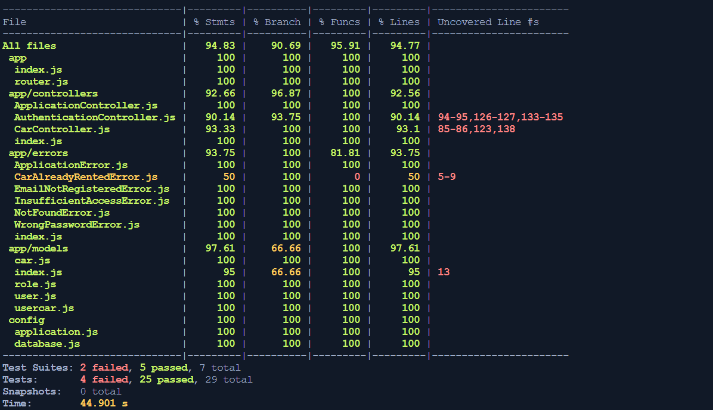

# BCR API

Di dalam repository ini terdapat implementasi API dari Binar Car Rental.
Tugas kalian disini adalah:
1. Fork repository
2. Tulis unit test di dalam repository ini menggunakan `jest`.
3. Coverage minimal 70%

Good luck!


# Challenge Chapter 7

## Test Result



## Setup

1. Install Library

```bash
yarn install
```

2. Create an .env file on root folder

```bash
JWT_SIGNATURE_KEY=Rahasia
DB_USER=
DB_PASSWORD=
DB_NAME=
DB_HOST=
DB_PORT=
```

3. Create Database

```bash
yarn db:create
```

4. Migrating the model

```bash
yarn db:migrate
```

5. Using seeder

```bash
yarn db:seed
```

## How To Test

-   Testing the app
    -   it will execute pre-script command to run on test mode

```bash
yarn test
```